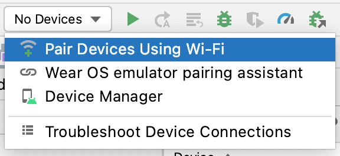
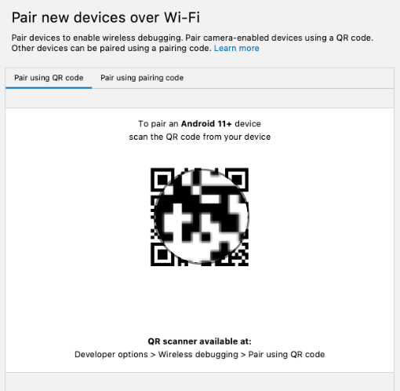

- 与设备配对

```
1.在 Android Studio 中，从运行配置下拉菜单中选择 Pair Devices Using Wi-Fi。（第一张图）；系统随即会打开 Pair devices over Wi-Fi 对话框。
2.前往开发者选项，向下滚动到调试部分，然后开启无线调试。
3.在要允许通过此网络进行无线调试吗？弹出式窗口中，选择允许。
4.如需使用二维码配对您的设备，请选择使用二维码配对设备，然后在计算机上扫描该二维码。如需使用配对码配对您的设备，请选择使用配对码配对设备，然后输入 6 位数配对码。
5.点击“Run”，然后您就可以将应用部署到设备上了。
```

### Pair Devices Using Wi-Fi


###  Pair devices over Wi-Fi 对话框。

### 启无线调试
