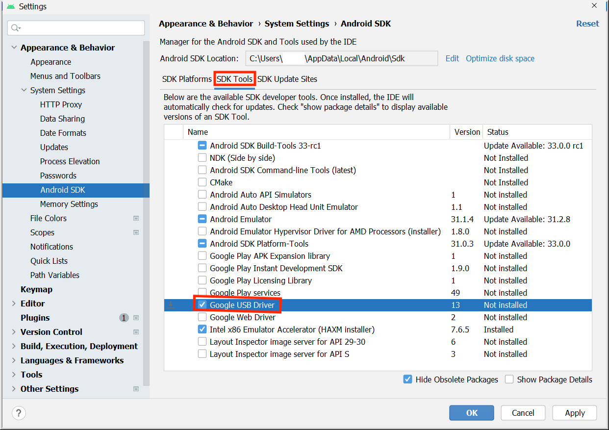
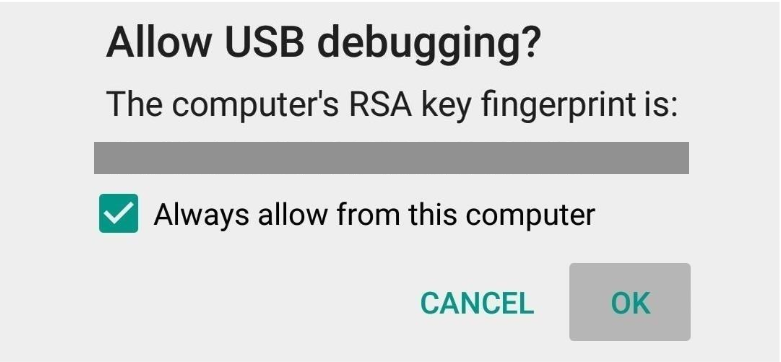

- 开启开发者模式

```tex
1. 在 Android 设备上，依次点按**设置** > **关于手机**。
2. 连续点按**版本号**七次。
3. 如果出现提示，输入您的设备密码或 PIN 码。如果显示**您现在处于开发者模式！**消息，则说明您已成功启用开发者模式。
4. 返回“设置”主屏幕，然后依次点按**系统** > **开发者选项**。
5. 如果您没有看到**开发者选项**，请点按**高级选项**。
6. 点按**开发者选项**，然后点按 **USB 调试**切换开关将其开启。
```

- 安装 Google USB 驱动程序

```tex
1.在 Android Studio 中，依次点击 Tools > SDK Manager。系统随即会打开 Preferences > Appearance & Behavior > System Settings > Android SDK 对话框。
2.点击 SDK Tools 标签页。
3.选择 Google USB Driver，然后点击 OK。
如下图
```



- 通过数据线在 Android 设备上运行

```tex
1.使用 USB 线将 Android 设备连接到计算机。设备上应会显示一个对话框，要求您允许进行 USB 调试。
2.选中一律允许使用这台计算机进行调试复选框，然后点按确定。
3.在计算机上的 Android Studio 中，务必从下拉菜单中选择您的设备。
4.选择您的设备，然后点击 OK。Android Studio 会在设备上安装并运行该应用。
5.如果您的设备运行的 Android 平台未在 Android Studio 中安装，并且系统显示消息来询问您是否要安装所需的平台，请依次点击 Install > Continue > Finish。Android Studio 会在设备上安装并运行该应用。
参考下图：
```

### 设备提醒



### 运行按钮

