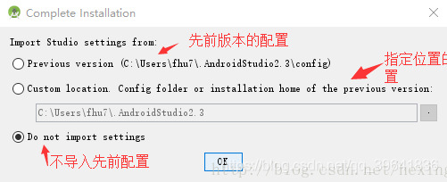
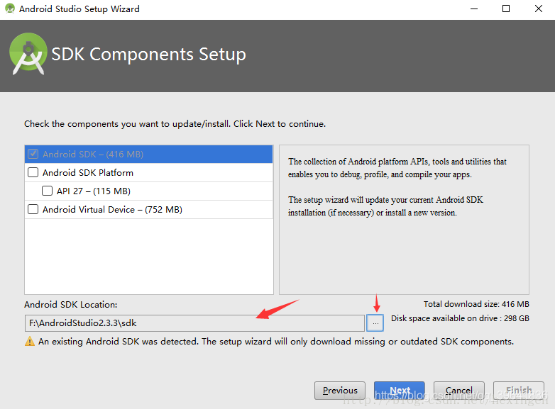
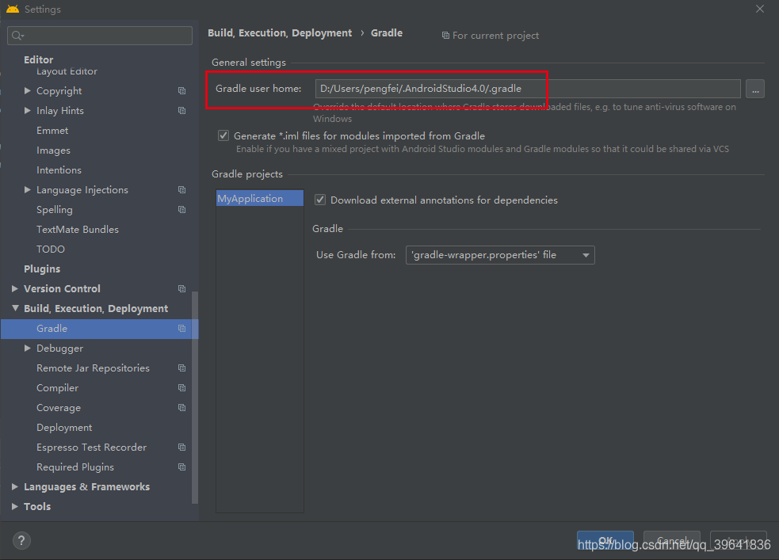

- 运行旧项目技巧

```java
// File -》 Project Structure -》 Project ： 选择最新版本的 Gradle 版本
```

- 多个版本存在

```tex
1、去官方网站下载所需要的版本：https://developer.android.com/studio/archive?hl=zh-cn
2、把下载好的放到给定目录去解压：打开  android-studio -->  studio64.exe
3、下载 `SDK Components` 的时候，选择不同的目录，比如 D:/sdk/x.x.x;
4、配置该 `IDE` 的 `gradle` ，File --> Settings --> Build,Excution,Deployment  -->  General setting ( Gradle user home: )，配置一个新的目录。
5、详见下面图解：
```





