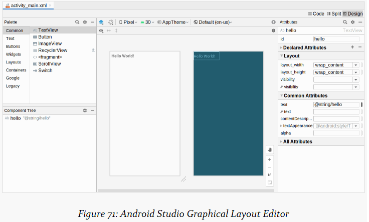

1. Containers----->对应 android.view.ViewGroup 组件，通常使用的 layout 是 ContraintLayout;

- Widgets的属性

```properties
// visibility，用来控制是否可见
• android:visibility attribute in a layout resource
• setVisibility() in Java
• Assigning a value to the visibility property in Kotlin

//组件的所有属性
https://developer.android.com/reference/android/widget/TextView.html
```

- Widgets IDs

```xml
<!--- android:id 属性，值的格式 @+id/xxx 和 @id/xxx基本是相等的，第一次引用需要 + 号，第二次则可以不用 ----->
<TextView android:id="@+id/hello"
xmlns:android="http://schemas.android.com/apk/res/android"
android:layout_width="wrap_content"
android:layout_height="wrap_content"
android:padding="@dimen/hello_padding"
android:text="@string/hello"
android:textSize="@dimen/hello_size"
android:textStyle="bold" />

<!----- Size，通常文本的 Size 是由文本的内容决定的；有时候由 父级 的Widget来决定；有时候，则由提供的一系列的尺寸来决定  ------>
<!--- 尺寸是 android:layout_with  和  android:layout_height --->

<!--- margin属性，使用 android:layout_margin 来进行设置距离 --->
<!--- margin属性，使用 android:padding 来进行设置距离 --->
```

- `dimen Things`尺寸

```xml
<?xml version="1.0" encoding="utf-8"?>
<resources>
  <dimen name="hello_size">24sp</dimen>
  <dimen name="hello_padding">8dp</dimen>
</resources>
<!--- 用 @dimen/hello_size 来引用 --->
```

- 关于单位

```properties
dp // dp 是“密度无关像素”的缩写。160 dp == 1 inch ，安卓主要使用的单位
sp // sp 缩放像素  会根据用户设置的缩放改变而改变；
in // inches
mm // 毫米
px // 硬件像素
```

- 引入图像编辑器---Design视图

```properties
// Design 代表的是图形编辑器，如下图
// 左侧有 Palette 调色板
// Preview 是用来预览的
// Blupring 是用来，描述了布局资源，不会展示的太细节，对于复杂的页面很有用
// Preview Toolbar 有切换 preview、bluprint 或者 两者的视图，旋转设备，用来选择 API Level，一个选择 theme 主题，一个语言系统；
// Component Tree 显示现有的组件；
// Attribute 属性，Attribute 属性能够在顶部进行属性的查找；
// 可以把空间拖拽到 主视图 或者 Component Tree 进行添加
```



- TextView

```properties
// 可以在右侧的属性值，点击 打开（一个变形的 O） 来添加属性，选择文本等

android:typeface 用于设置标签的字体
android:textStyle 指用来设置为 粗体(bold)、斜体(italic)或粗斜体(bold_italic)
android:textColor 用来设置 标签 的文本，颜色的格式（有 RGB ，ARGB 或者 @color/colorAccent）
```

- Button

```properties
// Button 是 TextView 的子类，因此，TextView的属性都适用于 Button
tools:text="123 seconds since started!"
tool:text 用于显示运行时的文本，以减轻界面编辑的负担；
```

