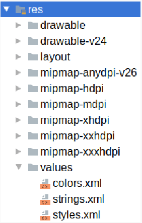
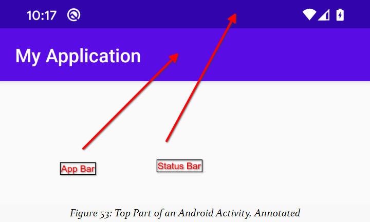

- res目录

```tex
\res 目录是保存在 Java/Kotlin 源码之外的静态信息位； app/src/main/res/
\\该目录用来存储 icons、images 和 一些国际化资源 等；
\res res会根据功能用途不同的资源进行不同的资源存放，看下图；有些的资源目录是有后缀的，后缀是特定的资源文件的集合；
```



- API 级别

```tex
\API \level 当你创建一个 AVD 模拟器给你的安卓 app 的时候，你应该设置好你对应的模拟器的 API Level，当你分发你的应用程序时，你将指明你应用程序支持的最早 API 级别；

```

- 资源的更详细说明

```tex
1、资源也可以成为配置，带有后缀的目录表示这些资源用于什么配置；
\examples drawable/有适用于任何配置的资源，但drawable- v24/有只用于API 24级及以上设备的资源（即Android 7.0及以上）。
\examples \two mipmap-anydpi-v26/ 具有适用于任何屏幕密度的资源，但它们只会在 API 级别 26 及更高级别的设备上使用
\examples \three mipmap-mdpi/ 具有围绕“中等密度”屏幕设计的资源，其中密度约为 160dpi（dpi = 每英寸点数）
```

- `res/Layouts`目录

```tex
1、\layout 用于描述一些列的用户界面：如 `A screen` 、`A row In a list`、`A cell in a grid`、`一个可以在屏幕复用的 块` 等等；
2、xml文件都会映射到一个组件，下面代码块有一个 `Constraintlayout` layout 容器，这个容器包含了一个单独的 TextView 小部件；
```

```xml
<?xml version="1.0" encoding="utf-8"?>
<androidx.constraintlayout.widget.ConstraintLayout<androidx.constraintlayout.widget.ConstraintLayout
xmlns:android="http://schemas.android.com/apk/res/android"
xmlns:app="http://schemas.android.com/apk/res-auto"
xmlns:tools="http://schemas.android.com/tools"
android:layout_width="match_parent"
android:layout_height="match_parent"
tools:context=".MainActivity">>
    <TextView
        android:layout_width="wrap_content"
        android:layout_height="wrap_content"
        android:text="Hello World!"
        app:layout_constraintBottom_toBottomOf="parent"
        app:layout_constraintLeft_toLeftOf="parent"
        app:layout_constraintRight_toRightOf="parent"
        app:layout_constraintTop_toTopOf="parent" />
	</TextView>
</androidx.constraintlayout.widget.ConstraintLayout>
```

- `drawable`和`mipmap`目录

```tex
1、涉及到一些资源，及一些开机启动图等等；
2、安卓开发人员的约定：
 2-1、您的主屏幕启动器图标是一个 `mipmap`；
 2-2、其他的位于 `drawable`
```

- `values`目录

```
1、用于存放国际化资源、颜色值、一些文案等等，通过 xml 来进行存放数据；
如下代码的 string.xml   R.string.app_name
```

```xml
<resources>
	<string<string name="app_name">>Hello World</string></string>
</resources></resources
```

下面是 color 的资源  R.color.xxx

```xml
<?xml version="1.0" encoding="utf-8"?>
<resources>
    <color name="purple_200">>#FFBB86FC</color>
    <color name="purple_500">>#FF6200EE</color>
    <color name="purple_700">>#FF3700B3</color>
    <color name="teal_200">>#FF03DAC5</color>
    <color name="teal_700">>#FF018786</color>
    <color name="black">>#FF000000</color>
    <color name="white">>#FFFFFFFF</color>
</resources>
```

`Styles` 和 `Themes`

`Styles`允许你提供一个 UI 集合的属性来定制界面，`Theme`就是这样的一种作用，为 activity 提供样式，下面是一个例子。`@color/purple_500`-->使用了 color.xml 的资源；

@mipmap/ic_launcher

```xml
<resources xmlns:tools="http://schemas.android.com/tools">>
<!-- Base application theme. -->
    <style name="Theme.HelloWorld" parent="Theme.MaterialComponents.DayNight.DarkActionBar">>
        <!-- Primary brand color. 应用于 app bar北京、foreground 文本，看下图 -->
        <item name="colorPrimary">>@color/purple_500</item>
        <item name="colorPrimaryVariant">>@color/purple_700</item>
        <item name="colorOnPrimary">>@color/white</item>
        <!-- Secondary brand color. -->
        <item name="colorSecondary">>@color/teal_200</item>
        <item name="colorSecondaryVariant">>@color/teal_700</item>
        <item name="colorOnSecondary">>@color/black</item>
        <!-- Status bar color. -->
        <item name="android:statusBarColor" tools:targetApi="l">>
        ?attr/colorPrimaryVariant
        </item>
    <!-- Customize your theme here. -->
    </style>
</resources>
```

