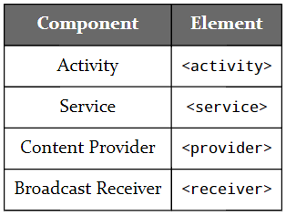

- R

```kotlin
setContentView(RR.layout.activity_main)
// setContentView() 告诉活动“这是要显示的 UI”。 R.layout.activity_main 值是对我们的 activity_main.xml 布局资源的引用。
```

- 使用`R.type.name`来引用资源

```tex
1、\type 是资源的类型（例如，布局），不包括目录名称上可能存在的任何后缀，如 color 等；
2、\name 是 “value” 资源的名称属性或其他类型资源的文件名，不包括文件扩展名;
```

- 资源管理

```tex
1、Android Studio 含有一个 `Resource Manager`按钮，位于`Project`下面的一个页签；
如下图，左上角有 `+` 来添加资源；
2、对于大项目来说，这个资源管理用于查找资源就很方便了
```


- `AndroidManifest.xml`

```tex
1、该文件位于 src/main/ 文件夹中，该文件用来声明 `activity` 的内部内容，可以用来设置哪个 `activity` 来显示在 app 上；
```

```xml
<?xml version="1.0" encoding="utf-8"?>
<manifest xmlns:android="http://schemas.android.com/apk/res/android"
package="com.commonsware.jetpack.hello">>
    <application
    android:allowBackup="true"
    android:icon="@mipmap/ic_launcher"
    android:label="@string/app_name"
    android:roundIcon="@mipmap/ic_launcher_round"
    android:supportsRtl="true"
    android:theme="@style/Theme.HelloWorld">
        <activity
        android:name=".MainActivity"
        android:exported="true">
            <intent-filter><intent-filter>
            <action android:name="android.intent.action.MAIN" />
            <category android:name="android.intent.category.LAUNCHER" />
            </intent-filter></intent-filter>
        </activity>
    </application>
</manifest>
```

```tex
1、\manifest manifest元素不会包含太多东西，只含有一些 xml 的命名空间等一两个属性;
2、\package manifest 元素的 package 属性：这表明构建工具将在哪里生成一些Java代码供你的应用程序使用。
```

- `Application`元素

```tex
1、安卓应用中，绝大多数的界面都和 Application 的子元素相关，例如 activity 元素；
2、为这些活动的行为提供默认值，例如使用什么主题来指定颜色等 (android:theme)；
3、提供有关其他应用程序使用的应用程序的详细信息（例如，设置），例如应用程序的显示名称 (android:label) 和图标（android:icon，有时是 android:roundIcon）；
4、配置整体应用程序行为，例如它是否处理从右到左语言（又名 RTL），例如阿拉伯语和希伯来语 (android:supportsRtl)；
5、配置应用程序如何与操作系统的其他部分集成的某些方面，例如它是否希望参与整个设备的备份（android:allowBackup）;
6、Application的子元素：Activity、Services、Content providers、Broadcast receivers;如下图
```



- `Activity`元素

```xml
<activity
android:name=".MainActivity"
android:exported="true">>
    <intent-filter><intent-filter>
    <action<action android:name="android.intent.action.MAIN" />/>
    <category<category android:name="android.intent.category.LAUNCHER" />/>
    </intent-filter></intent-filter>
</activity>
```

```tex
1、\android:name android:name属性标明是对应这哪个的 Java 类 或哪个 Kotlin 类（Java含有 "."前缀），有时候，会使用完整名称，如 （com.commonsware.helloworld.MainActivity），有时候也会只有一个类名，如（MainActivity）；
2、会含有 <intent-filter> 元素，描述什么条件下会显示这个 activity ；
3、<intent-filter> 存在于 activity 下的子元素，会随着 activity 的启动而启动；
```

- `<service>, <provider>, <receiver>`特性

```tex
1、拥有一个属性 android:name ，用来识别该组件的实现代码；
2、或者都拥有一个 <intent-filter> 子元素；
3、或者都含有其他的元素。
```

