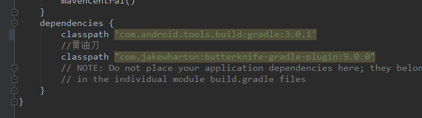

- android studio的版本对照

```tex
1、studio 不同版本下载地址，国内版：https://www.androiddevtools.cn/android-studio.html
2、
```

| 插件版本      | 所需的 Gradle 版本 |
| ------------- | ------------------ |
| 1.0.0 - 1.1.3 | 2.2.1 - 2.3        |
| 1.2.0 - 1.3.1 | 2.2.1 - 2.9        |
| 1.5.0         | 2.2.1 - 2.13       |
| 2.0.0 - 2.1.2 | 2.10 - 2.13        |
| 2.1.3 - 2.2.3 | 2.14.1+            |
| 2.3.0+        | 3.3+               |
| 3.0.0+        | 4.1+               |
| 3.1.0+        | 4.4+               |
| 3.2.0 - 3.2.1 | 4.6+               |
| 3.3.0 - 3.3.2 | 4.10.1+            |
| 3.4.0 - 3.4.1 | 5.1.1+             |
| 3.5.0+        | 5.4.1-5.6.4        |

- 黄油刀问题

```tex
An Obsolete warning API " 'variantOutput.getProcessResources()' is obsolete and has been replaced with 'variantOutput.getProcessResourcesProvider()'." is shown in Library At V10.1.0 #1431


https://github.com/JakeWharton/butterknife/issues/1431

修改为下面图片的配置：
```

