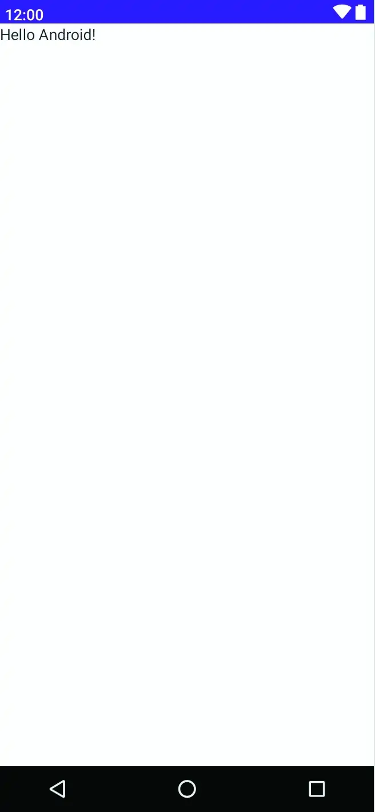

- 使用Jetpack Compose构建的项目

```tex
\activity 的主要代码：位于应用程序 -> java -> com.example下的MainActivity.kt文件中。
```

- 项目解析( MainActivity.kt 文件)

```kotlin
package com.example.composedemo // 表明 MainActivity.kt 的所有 class 和 函数都属于 com.example 

// 接下来的代码
import android.os.Bundle
import androidx.activity.ComponentActivity
import androidx.activity.compose.setContent
import androidx.compose.material.MaterialTheme
import androidx.compose.material.Surface
import androidx.compose.material.Text
// 第二段代码时候构建应用程序的基础，为了使应用能高效运行，避免导入不必要的 库

// onCreate 是 MainActivity 实现的单个方法，当 Android 运行时系统调用 Activity 的第一个方法，它使得 activity 和 Compose-base 搭建了一条桥梁；
// onCreate 方法声明活动用户界面的内容将由名为 XxxxxxTheme 的可组合函数提供。
// XxxxxxTheme 的声明文件位于 app -> <package name> -> ui.theme 文件夹中，ui.theme 文件夹的其他文件和 XxxxxxTheme 一起定义了 activity 要使用的 颜色、字体和形状，并提供了一个中心位置，从中可以定义应用程序用户界面的整体主题；
// XxxxxTheme 的调用包含了一个回调函数，里面有调用 Surface ，Surface是一个内置的 Compose 组件，旨在为其他 composables 提供背景；

```

- Surface

```kotlin
ComposeDemoTheme {
    // A surface container using the 'background' color from the theme
    Surface(
        modifier = Modifier.fillMaxSize(),
        color = MaterialTheme.colors.background
    ) {
        Greeting("Android")
    }
}

// 上代码块中，Surface 组件被配置为填充整个屏幕，并将背景设置为 Android Material Design 主题定义的标准背景色
// Material Design 是 Google 开发的一套设计指南
// 最后，Surface 被配置为包含一个名为 Greeting 的可组合函数，该函数被传递一个字符串值“Android”
```

- Greeting

```kotlin
@Composable
fun Greeting(name: String) {
    Text(text = "Hello $name!")
}
// @Composable (可组合) 意味着可以被 setContent 内的调用
```

- DefaultPreview

```kotlin
@Preview(showBackground = true)
@Composable
fun DefaultPreview() {
    ComposeDemoTheme {
        Greeting("Android")
    }
}
// @Preview 标识为该方法是预览函数，当不用运行模拟器或真机都可以达到看到界面的效果

@Preview(showSystemUi = true)// 标识除了界面外，预览屏幕装饰的预览-----如下图

// 修改后重新预览需要构建和刷新才能反应在预览中，预览面板还包括一个交互模式，允许您在用户界面组件上触发事件（例如单击按钮、移动滑块、滚动列表等）
```




