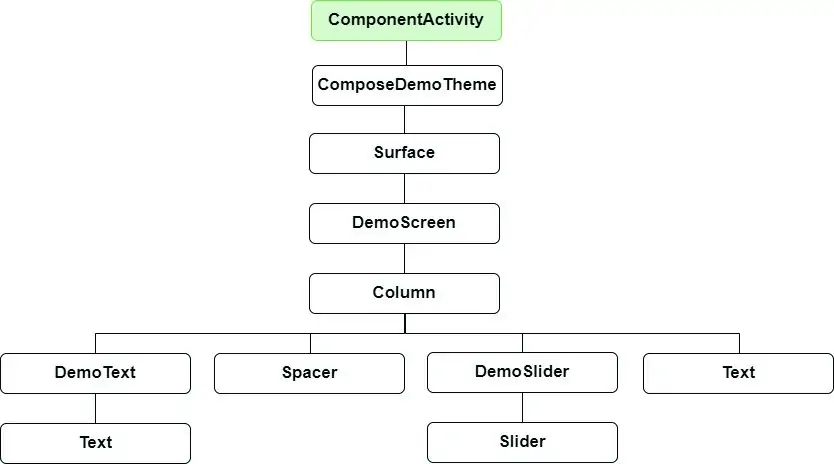
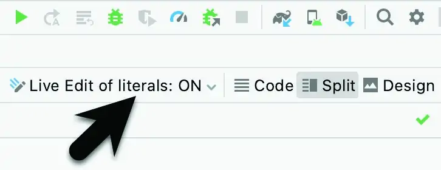
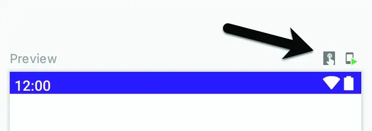

- 可组合层次结构

```kotlin
// Android 界面可组合层次结构，相当于依次调用等----如下图

// 下图中的所有元素，除了 ComponentActivity 之外，都是可组合函数。在这些函数中，Surface、Column、Spacer、Text 和 Slider 函数是 Compose 提供的内置可组合项。另一方面，DemoScreen、DemoText 和 DemoSlider 可组合项是我们将创建的函数，用于提供设计结构和应用程序所需的自定义功能。
```



- 添加一个可组合的 `DemoText`

```kotlin
// 将光标置于 MainActivity 声明的最后一个右大括号 (}) 下方，并添加以下函数声明：
// @Composable 注解通知构建系统这是一个可组合函数。
@Composable
fun DemoText(message: String, fontSize: Float) {
    Text(
        text = message,
        fontSize = fontSize.sp,
        fontWeight = FontWeight.Bold
    )
}

// 标红的代码需要使用 Alt + Enter（Opt + Enter） 来进行自动导入缺少的库

@Preview
@Composable
fun DemoTextPreview() { // 添加 DemoText 可组合项，注意命名 一个为 DemoText， 另一个为 DemoTextPreview
    DemoText(message = "Welcome to Android", fontSize = 12f)
}

// 对MainActivity.kt文件中的代码所做的微小更改（例如更改值）将立即反映在预览中，无需构建和刷新。不过要开启如下图的 实时预览 设置；
```



- 添加 `DemoSlider` 可组合项

```kotlin
.
.
import androidx.compose.foundation.layout.*
import androidx.compose.material.Slider
import androidx.compose.ui.unit.dp
.
.
@Composable
fun DemoSlider(sliderPosition: Float, onPositionChange: (Float) -> Unit ) {
    Slider(
        modifier = Modifier.padding(10.dp),
        valueRange = 20f..40f,
        value = sliderPosition,
        onValueChange = { onPositionChange(it) }
    )
}

// DemoSlider需要传递一个包含当前滑块位置的变量和一个事件处理函数或 lambda 以在用户移动滑块时调用，以便可以存储新位置并将其传递给两个文本可组合项。

// 参数说明
/**
DemoSlider 声明包含单个 Slider 可组合项，依次传递四个参数。第一个是 Modifier 实例，配置为在滑块周围添加填充空间。Modifier 是一个内置于 Compose 中的 Kotlin 类，它允许在单个对象中的可组合项上设置各种属性。修饰符也可以在一个可组合项中创建和自定义，然后再传递到其他可组合项，在其他可组合项中可以在应用它们之前进一步修改它们。

传递给 Slider 的第二个值是滑块值允许的范围（在这种情况下，滑块被限制在 20 到 40 之间的值）。

下一个参数将滑块的值设置为调用者传递的位置。这确保每次重新组合 DemoSlider 时它都保留最后的位置值。

最后，我们设置Slider 的onValueChange参数以调用我们将在稍后调用时传递给 DemoSlider 可组合项的函数或 lambda。每次滑块位置发生变化时，都会进行调用并传递我们可以通过 Kotlin it关键字访问的当前值。
*/
```

- 添加 `DemoScreen` 可组合项

```kotlin
.
.
import androidx.compose.runtime.*
.
.
@Composable
fun DemoScreen() {
 
    var sliderPosition by remember { mutableStateOf(20f) }
 
    val handlePositionChange = { position : Float ->
        sliderPosition = position
    }
}
/**
这将包含一个名为sliderPosition的变量，其中存储当前滑块位置和要传递给 DemoSlider 的handlePositionChange事件处理程序的实现。每次使用更新值调用时，此 lambda 将负责将当前位置存储在sliderPosition变量中。最后，DemoScreen 将包含一个 Column 可组合项，配置为显示 DemoText、Spacer、DemoSlider 和第二个（尚未添加）垂直排列的 Text 可组合项。
*/
```

- `DemoScreen` 实现中唯一剩下的工作是添加一个包含所需可组合函数的 Column：

```kotlin
.
.
import androidx.compose.ui.Alignment
.
.
@Composable
fun DemoScreen() {
 
    var sliderPosition by remember { mutableStateOf(20f) }
 
    val handlePositionChange = { position : Float ->
        sliderPosition = position
    }
 
    Column(
        horizontalAlignment = Alignment.CenterHorizontally,
        verticalArrangement = Arrangement.Center,
        modifier = Modifier.fillMaxSize()
    ) {
 
        DemoText(message = "Welcome to Compose", fontSize = sliderPosition)
 
        Spacer(modifier = Modifier.height(150.dp))
 
        DemoSlider(
            sliderPosition = sliderPosition,
            onPositionChange = handlePositionChange
        )
 
        Text(
            style = MaterialTheme.typography.h2,
            text = sliderPosition.toInt().toString() + "sp"
        )
    }
}

/**
有关这些变化的注意事项可归纳如下：

调用 DemoSlider 时，会将对我们的 handlePositionChange 事件处理程序的引用作为 onPositionChange 参数传递给它。
Column 可组合项接受自定义布局行为的参数。在这种情况下，我们已将列配置为使其子级在水平和垂直方向上居中。
已将一个修改器传递给 Spacer，以在 DemoText 和 DemoSlider 组件之间放置一个 150dp 的垂直空间。
第二个 Text 可组合项配置为使用 Material 主题的 h2（标题 2）样式。sliderPosition值从 Float 转换为整数，以便仅显示整数，然后在显示给用户之前转换为字符串值。
*/
```

- 预览交互模式，使得预览模式下可以进行一些交互

