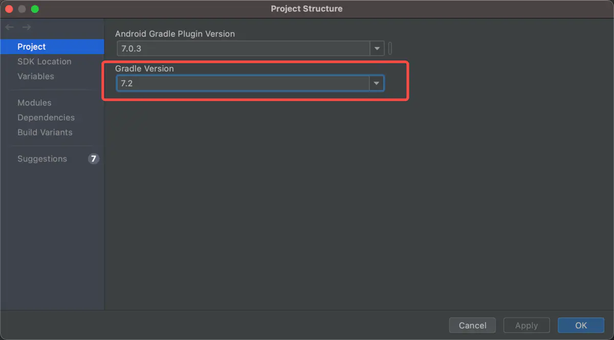

- 一些报错

```java
// Caused by: org.codehaus.groovy.control.MultipleCompilationErrorsException: startup failed:
// 将 File -> Project Structure -> Project 下的 Gradle Version 修改为可以使用的版本，其他项目可以运行的版本是 7.5
```



