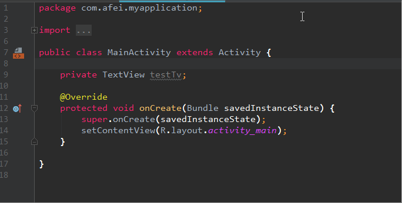
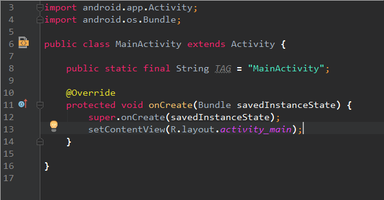
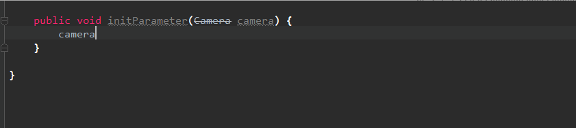
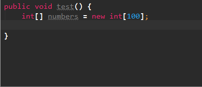
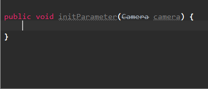
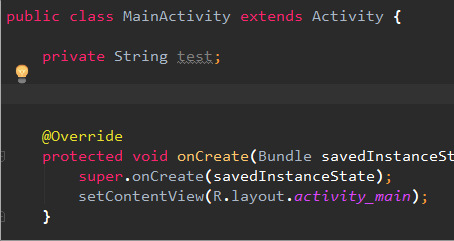
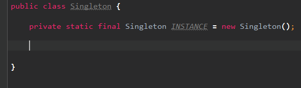

- 查找文件

```bash
Ctrl + shift + N;
```

- 查找内容

```bash
Ctrl + shift + F
```

- 重命名

```bash
shift + F6
```

- 展开和收起代码

```bash
Ctrl + +/-
Ctrl + shift + +/-
```

- 退回和前进

```bash
Ctrl + alt + / left right
```

- 快速写块状的代码

```tex
1、选中代码之后，按 Ctrl + Alt + T，就可以选择要使用的代码块；
2、Ubuntu下，快捷键的修改，File > Setting > Keymap，搜索 `surrou`
```

- 使方法变成静态方法

```tex
1、选中方法 》 右键 》 Refactor 》 Make Static 》 Find Refactoring Preview  》 Do Refactor
```

- 高性能的快捷键

```tex
1、psf + Tab = public static final (prsf = private static final)；
2、logd + Tab ，可以快速生成输入日志方法；
3、xxx.xxx().var + Tab ，可以快速生成表达式的返回值；
4、fori / foreach 循环；
5、sout = System.out.println() ；
6、nn 和 null，可以用来快速添加等于和不能与 null 的 if 块；
7、get / set 获取或设置成员变量；
8、geti 获取单例；
9、xxx.xxx().try + Tab ，快速添加 try 块；
10、详见下图：xxx xxx 如何快速写一个方法
```















- 其他高性能快捷键

```tex
1、xxx.xxx() + (Ctrl + Alt + V) 会自动推导成员变量类型写出来；
2、自动提取参数：Ctrl + Alt + P；
3、自动提取方法：Ctrl + Alt + M;
4、重构类 Ctrl + Shift + Alt + T；
5、重命名 Shift + F6；
```

