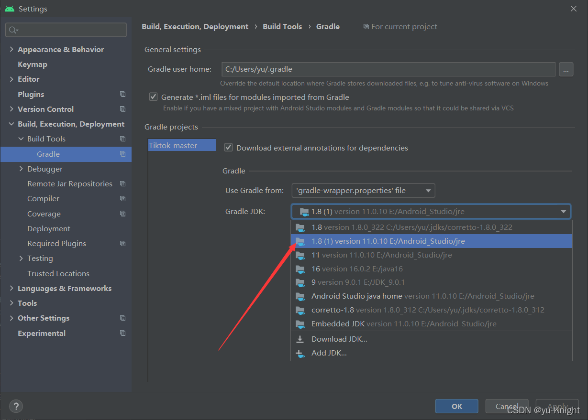

- 就项目运行的难点

```tex
1、更改 build.gradle(也就是 Project Structure);
2、把 https://maven.google.com 替换为 `https://dl.google.com/dl/android/maven2/`；详见页面：https://www.jianshu.com/p/bbb946ab1b2b
3、原来，'https://jitpack.io' 要改成 'https://www.jitpack.io' ，正确的姿势如下；
4、compileSdkVersion 31 使用 31 版本的 SDK 进行编译；  修改 SDK 的运行版本 targetSdkVersion 31 ，表示生成的目标版本为 31。
```

- 解決快捷键冲突

```tex
1、右键输入法 》 设置 》 找到对应的快捷键 》 修改掉
```

- 修改`JDK`版本-->设置

