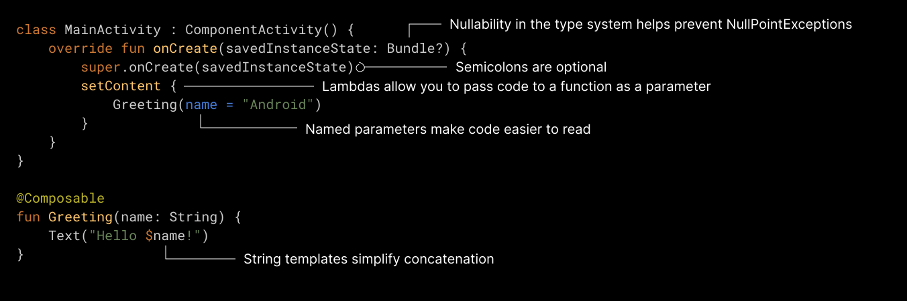

- ?操作符

```kotlin
var a: String = "a"
var b: String? = "b"
b = null// b 可以赋值为 null ， a 不可以

var test: String = null
print(test?.length)// 如果 b 非空，就返回 b.length，否则返回 null;

val l = b?.length ?: -1// 在上述的代码中，如果在b为null的情况下z,可以使用此操作符

val l = b!!.length // 返回一个非空的 b 值，如果 b 为 null ,则会抛出一个 NullPointerException 异常
```

- 注意Lambdas函数

```tex
下图的对 Lambdas 函数做了说明，不然无法明白其中的语法。
```

