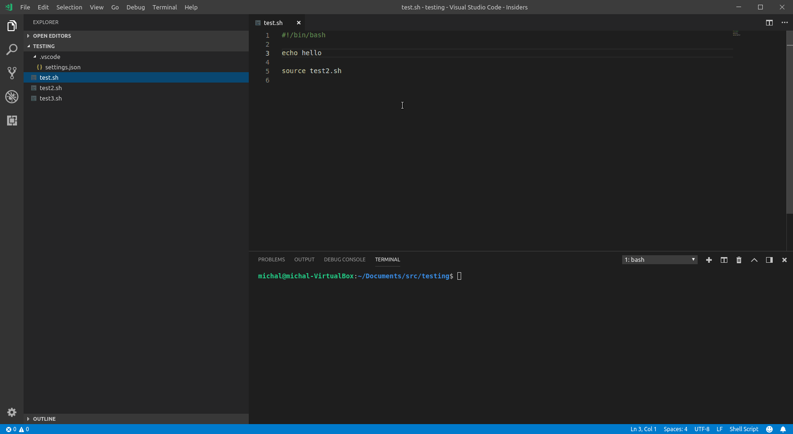
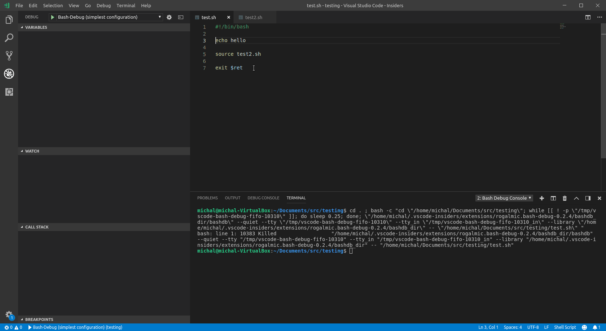
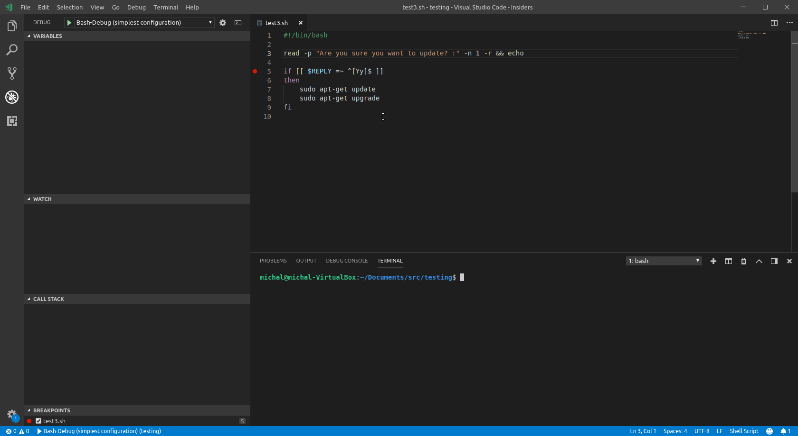
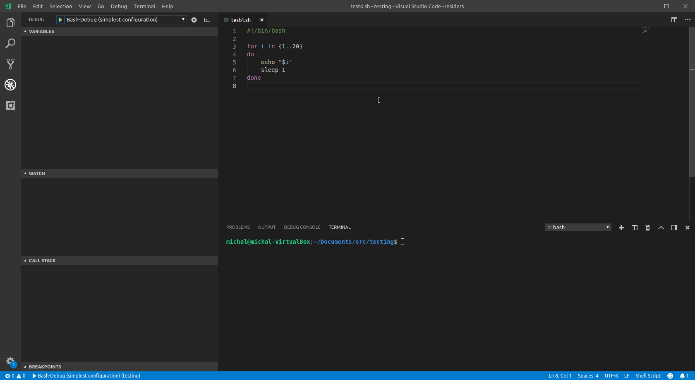
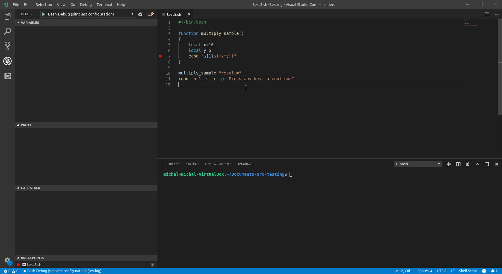
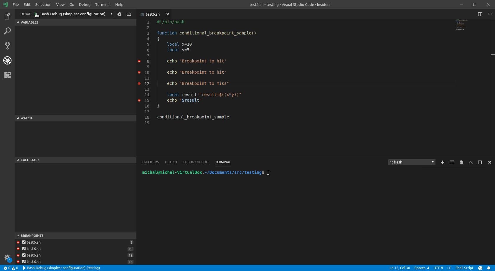

- bash调试

```bash
# -x 选项
$ bash -x example_script.sh
# 格式化输出
$ export PS4='+${BASH_SOURCE}:${LINENO}:${FUNCNAME[0]}'
```

- 使用专用的bashdb

```
# https://bashdb.sourceforge.net
```

- 使用例子图











